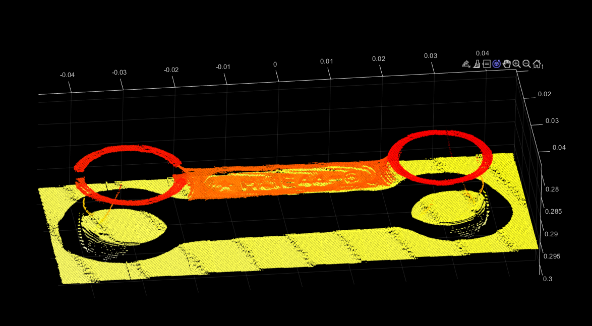

# laser-triangulation
- Implement Halcon's sheet-of-light 3D reconstruction demo with OpenCV

- The name of the Halcon demo is calibrate_sheet_of_light_calplate.hdev

## Tools used:
- OpenCV (4.5.3)
- CMake (3.21.0)

# Usage
1. Copy all images into a folder, name it as "images".
2. Move the folder to the same directory of the demo executable.
3. Run the demo executable.

## [Download](https://drive.google.com/file/d/1AW4xb54XKZ9XV_aJdCeAZJG_-yoiyfAF/view?usp=sharing) images

# Source code in "src" folder

- Code written when in development and test
  - calibrate_camera.cc Camera calibration.
  - calibrate_laser.cc Laser plane calibration.
  - calibrate_movement.cc Movement of the platform calibration.
  - extract.cc Laser line extraction.
  - scan.cc Reconstruction from images.
- Static library "utils" code
  - laser_triangulation.h The header
  - fit_3d_plane.cc
  - extract_laser_line.cc
  - reconstruction.cc
  - back_projection.cc Project image points to camera coordinate.
  - write_ply.cc Output result to PLY format.
- Final demo code: calibrate_sheet_of_light_calplate.cc

Reconstructed connection rod displayed in Matlab.

